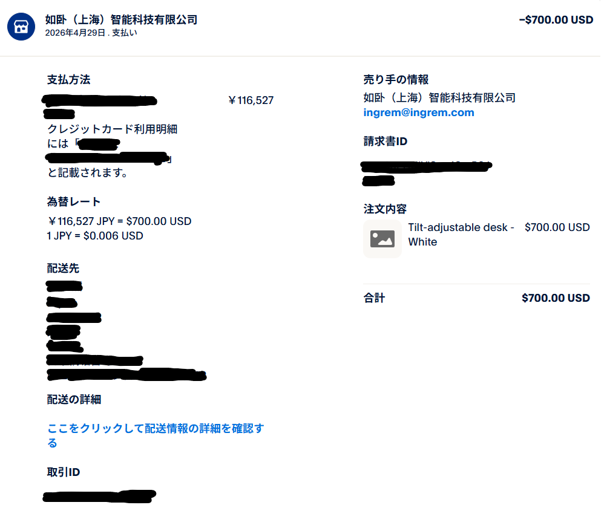
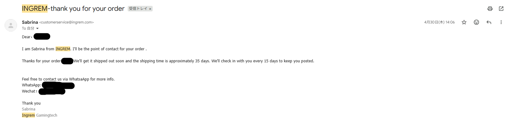
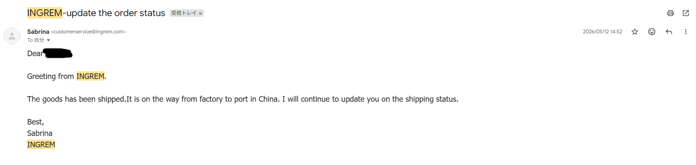

import LinkCard from "@/components/LinkCard.astro";

## 結論から言うと……
- **思ったよりも爆速！** なんと約2週間で我が家に無事届きました！

---

## 運命の購入から、ドキドキの到着まで！

### 🛒 ついにポチった購入日（4月29日）
「理想のだらだら環境を作るぞ！」と心に決め、ついに決済ボタンをポチり。
決済は安心のPayPalを利用しました。お値段は700ドル、当時のレートで **116,527円** の大お買い物です……！

### 📩 購入翌日（4月30日）：最初の一安心
ポチった翌日、無事に購入完了メールが届いてホッと一安心。
メールによると「お届けの目安は35日ほど」とのこと。気長に待つか〜、とのんびり構えていました。

### 📦 購入から13日後（5月12日）：動きがあった！
配送状況が更新されたよ！という通知メールが到着。
詳細URLを開いてワクワクしながらチェックしてみたものの……表記がかなりざっくりしていて、「今どこにいるの！？」とちょっと初々しい国際配送の洗礼を受けました（笑）。

### 🔔 購入から15日後（5月14日）：突然の急展開！？
のんびり待つつもりだったのに、まさかの佐川急便さんから「お荷物お届けのお知らせ」LINEが！
予定よりも早すぎる上に、発送元の名前が書いていなかったので、あの机だったのかワクワクしながら到着を待つことに。

### 🎉 購入から16日後（5月15日）：ついに到着！……デカい、重い！！
そしてついに我が家にデスクが到着しました！
……が、第一印象は**重すぎて持ち上がらない！！！**。
それもそのはず、箱の表記を見るとなんと **驚異の47kg** 。運送会社のお兄さんに心から感謝しつつ、なんとか部屋に迎え入れました。

---

## 次回予告！
次回は、この47kgの巨体をいよいよ開封！**組み立て＆ファーストインプレッション編**をお送りします。
一体どんな至高のだらだら環境が完成するのか……乞うご期待です！