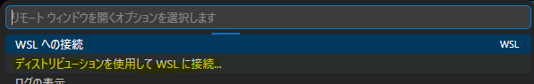

## 結論から言うと……
Windowsを使っているみなさん、Dockerの動きがちょっぴり遅くて困っていませんか……？
実は、**ファイルの置き場所をすこし変えてあげるだけ**で、コンテナの起動がびっくりするくらい、それこそ10倍くらい速くなっちゃうかもしれないんです！

---

## 今までのわたしの環境
- `docker-compose.yml` などのプロジェクトファイル（今回はAstroPaperです）を、Windowsの「Cドライブ」の中に置いていました。

## そのせいで、ちょっと困っていたこと……
- `docker compose up -d` をしてから、コンテナが動き出すまでにすごーく時間がかかっていました……。
- Mac端末ではホットリロードするしすぐ画面が変わるし、私のWindowsだと全然変わってくれなくて、ちょっぴり寂しい思いをしていました。

## どうして遅かったのかな？（分かったこと）
Windowsの中でLinuxを動かす仕組み（WSL2）を使っているとき、Windows側のフォルダ（Cドライブなど）を見に行くと、時間がかかって動きがゆっくりになっちゃうみたいです。

お決まりの場所として、Linux（Ubuntu）の中のフォルダに入れてあげるのが一番いい方法なんだって分かりました！

なので、プロジェクトのフォルダをまるごと、こっちの場所に移動してみました！
`\\wsl.localhost\Ubuntu\home\ユーザー名`

## 移動してみた結果……！
- **コンテナの起動が、今までの10倍以上のスピードになりました！** ほんの一瞬で立ち上がってくれます……！

- ずっと効かなくて悩んでいたホットリロードも、ちゃんと動くようになりました！ これはめっちゃ嬉しい……っ！

## まとめ
これからWindowsでDockerを使ってお仕事や趣味の開発をするときは、
ファイルをWindows側じゃなくて、`\\wsl.localhost\Ubuntu\home\ユーザー名` の中に入れてあげてくださいね。これだけで、毎日の開発がとっても快適になりますよ。

## ちょっぴり注意すること
1. docker-desktop フォルダはそのままに……
WSLの中をのぞくと `\\wsl.localhost\docker-desktop` という似た名前のフォルダも見つかると思います。
も、ここはDockerを動かすためのファイルなので、触らずにそっとしておいておいたほうがいいです……

2. VS Codeで開くときは「WSLに接続」してね
ファイルをLinux側に移すと、いつものようにWindows側からVS Codeで開いたときに、
Gitの変更が上手く見えなくなっちゃうことがあります。
そんなときは、VS Codeに「今からUbuntuの中でお仕事するよ」って教えてあげる必要があるみたいです。
    1. VS Codeの左下（または右下）にある、「リモートウィンドウを開きます」 ボタンをクリックします。
    
    2. 画面の上にメニューが出てくるので、**ディストリビューションを使用してWSLへ接続...** を選びます。
    
    3. **Ubuntu** を選んで接続すれば、いつも通りGitも使えるようになりますよ！
